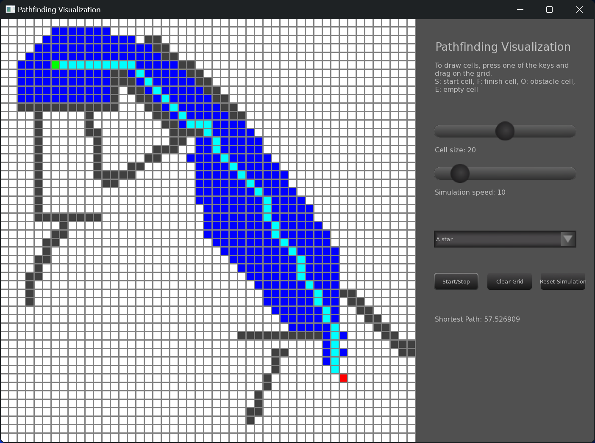

# Pathfinding algorithms visualization

This is a project to visualize how some algorithms like Djikstra and A* are able to find optimal paths between two points in a grid.

 

To try it out, go to Releases tab and download the **PathVis-installer.exe**, which will help you install the application alongiside with an uninstall executable.